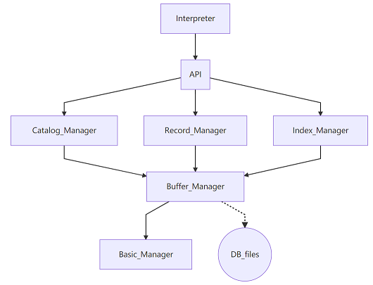

# MiniSQL

+ [A detailed Chinese report for this project](report.pdf)

## Project Introduction

+ This is my final report for the Database System course in Zhejiang University.
+ It is a simple SQL engine and supports classical SQL commands. Through the careful implementation of B + tree and buffer management in C++, this engine runs very fast.
+ The structure of source codes is as follows.

## File Structure
+ Build a new VS project using [these codes](https://github.com/jiangshibiao/MiniSQL/tree/master/src) to create this MiniSQL.
+ The files in [`Test_BPlusTree`](https://github.com/jiangshibiao/MiniSQL/tree/master/Test_BPlusTree) help to check the correctness of the B plus tree.
+ [Test](https://github.com/jiangshibiao/MiniSQL/tree/master/Test) contains several SQL samples which can be successfully executed in my MiniSQL.

## Functions and Commands
+ Create a new table
    ~~~SQL
    create table <table_name> (
        <name1> <type1> ,
        <name2> <type2> ,
        primary key (name)
    );
    ~~~
    - You can only assign one variable to be the primary key.
    - Add `unique` after an attribute to claim the uniqueness.
+ Delete a table
    ~~~SQL
    drop table <name>;
    ~~~
    - The corresponding index will be deleted along with the table.
+ Create an index for some table
    ~~~SQL
    create index <index_name> on <table_name> (<attribute_name>);
    ~~~
    - When a table is created, its primary key will build the index automatically.
    - The attribute assigned for index must be unique.
    - After this command, MiniSQL will search for the whole data and build a B+ tree according to assigned attribute. This B+ tree will be updated synchronously and automatically when its table changes.
+ Delete an index
    ~~~SQL
    drop index 索引名;
    ~~~
    - Delete the corresponding B+ tree.
    
+ Select some records
    ~~~SQL
    select * from <table_name>;
    select * from <table_name> where <cond_1> and ... and <cond_n>;
    ~~~
    - Display all the records meet these conditions. 
    - Each condition consists of `<attribute_name> <operator> <constant>`, where the constant must have the same type with the attribute.
    - Operator can be chosen from `<`, `>`, `<=`,  `>=`, `=`, `!=`.
    - *Normal select* will go through all the records and check the condition. If the attribute name has associated with index, MiniSQL will use B+ tree to find.
+ Insert a record
    ~~~SQL
    insert into <table_name> values (<value_1>, <value2>, ..., <value_n>);
    ~~~
    - Will check all the unique attribute.
    - Will scan all the attribute which has associated with index, and insert this message into the corresponding B+ tree.
+ Delete some records
    ~~~SQL
    delete from <table_name>;
    delete from <table_name> where <cond_1> and ... and <cond_n>;
    ~~~
    - Delete both the record and the index in the B+ tree.
+ Execute the file
    ~~~SQL
    execfile <file_name>;
    ~~~
    - Execute all the commands in this file.
    - Output the results or the error messages on the screen. If the number of commands is more than 20, it will display only the first 20 results.
+ Exit
    ~~~SQL
    quit;
    ~~~
    - Save all the operations, release cache and finally quit.

## Comment
+ **B+ tree** is the **highlight** of this project.
+ I spend much time on buffer and cache management, this experience is really painful.
+ I hadn't taken the Compiling Principle course when I finished this project, so I made such a mess of syntax analysis. (For example, use lots of `if..else..` phrases to check the syntax.>_<)
